## Recognition of Combat Vehicles with Convolutional Neural Networks

I'm doing this project to demo an "intelligent" dataset curator I built and show off how simple training a model is with the fastai library.

### Step 1. Get Images
Let's scrape images of various combat platforms from Google Image Search using my automated scaper.


```python
# from my github: https://github.com/wfleshman/DatasetScraper
from DatasetScraper.scraper import scrape

# google search queries I want to run
searches = [
    'M109A6 Paladin', # U.S. Army Self Propelled Howitzer
    'M1 Abrams',      # U.S. Army Tank
    'M2 Bradley',     # U.S. Army Tracked Fighting Vehicle
    'M1126 Stryker',  # U.S. Army Wheeled Fighting Vehicle
    '2S19 Msta',      # Russian Self Propelled Howitzer
    'T-90 tank',      # Russian Tank
    'BMP-3',          # Russian Tracked Fighting Vehicle
    'BTR-80'          # Russian Wheeled Fighting Vehicle
]

# class labels
labels = [
    'paladin',
    'abrams',
    'bradley',
    'stryker',
    '2s19',
    't90',
    'bmp3',
    'btr80'
]
```


```python
# for each search, scrape a few hunder images and save them in a folder named by their label
for i, search in enumerate(searches):
    print("Searching for",search)
    
    # scrape
    scrape(chromedriver='/bin/chromedriver', search=search, save_dir=labels[i])
```

    Searching for M109A6 Paladin
    [*] Opening browser
    [*] Scrolling to generate images
    [*] Scraping
    [*] Validating Files
    Searching for M1 Abrams
    [*] Opening browser
    [*] Scrolling to generate images
    [*] Scraping
    [*] Validating Files
    Searching for M2 Bradley
    [*] Opening browser
    [*] Scrolling to generate images
    [*] Scraping
    [*] Validating Files
    Searching for M1126 Stryker
    [*] Opening browser
    [*] Scrolling to generate images
    [*] Scraping
    [*] Validating Files
    Searching for 2S19 Msta
    [*] Opening browser
    [*] Scrolling to generate images
    [*] Scraping
    [*] Validating Files
    Searching for T-90 tank
    [*] Opening browser
    [*] Scrolling to generate images
    [*] Scraping
    [*] Validating Files
    Searching for BMP-3
    [*] Opening browser
    [*] Scrolling to generate images
    [*] Scraping
    [*] Validating Files
    Searching for BTR-80
    [*] Opening browser
    [*] Scrolling to generate images
    [*] Scraping
    [*] Validating Files


### Step 2. Curate Dataset
To train a good model we need a good dataset. Let's use my curator to find images that look similar using a neural network. We don't want duplicate or similar images in both our training and validation set or else we might get inflated results. We also don't want any junk images that aren't actually of the objects we're interested in. 


```python
from DatasetScraper.curator import Curator
import os
```


```python
# get images of paladins
imgs = [os.path.join('paladin', file_name) for file_name in os.listdir('paladin')]

# create curator
curator = Curator(img_paths=imgs)
```


```python
# duplicate detection and deletion
curator.duplicate_detection()
```


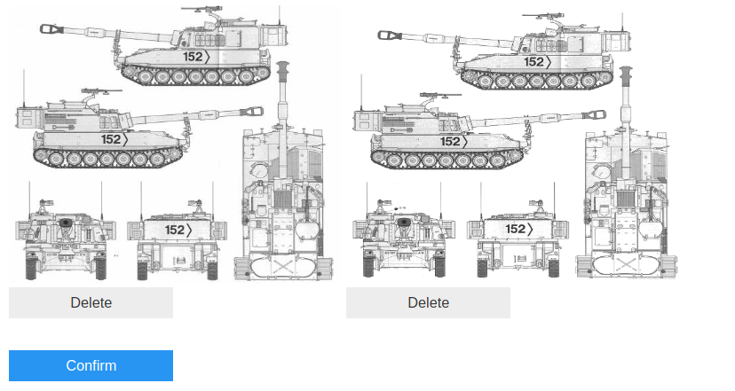


```python
# garbage detection and deletion
curator.garbage_detection()
```


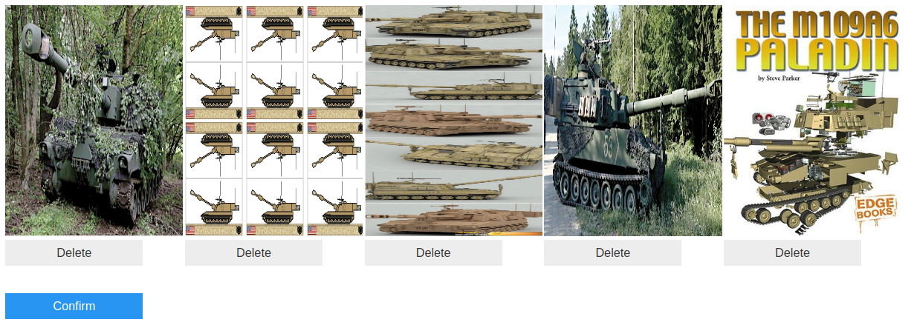


```python
# get images of abrams
imgs = [os.path.join('abrams', file_name) for file_name in os.listdir('abrams')]

# create curator
curator = Curator(img_paths=imgs)
```


```python
# duplicate detection and deletion
curator.duplicate_detection()
```


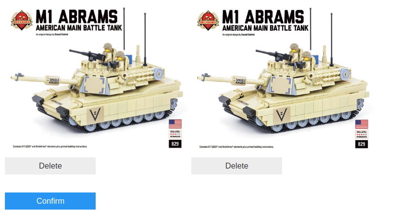


```python
# garbage detection and deletion
curator.garbage_detection()
```


```python
# get images of abrams
imgs = [os.path.join('bradley', file_name) for file_name in os.listdir('bradley')]

# create curator
curator = Curator(img_paths=imgs)
```


```python
# let's do garbage first
curator.garbage_detection()
```


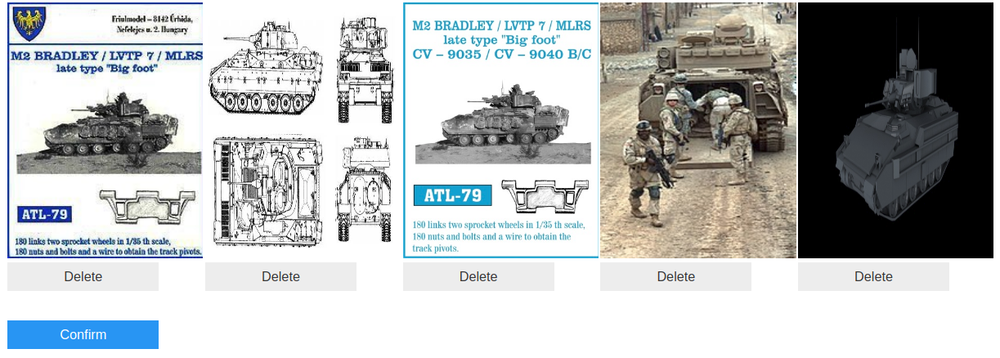


```python
# dup detection
curator.duplicate_detection()
```


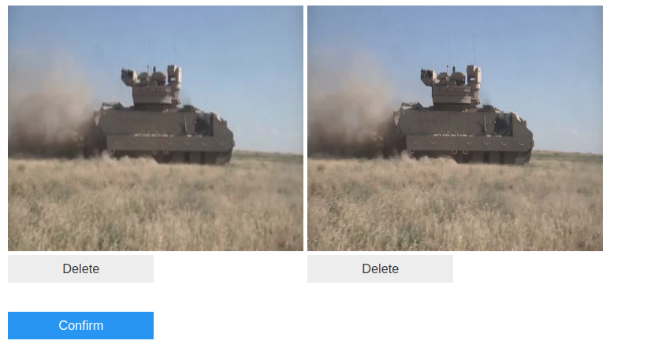


```python
# get images of strykers
imgs = [os.path.join('stryker', file_name) for file_name in os.listdir('stryker')]

# create curator
curator = Curator(img_paths=imgs)
```


```python
# garbage detection
curator.garbage_detection()
```


 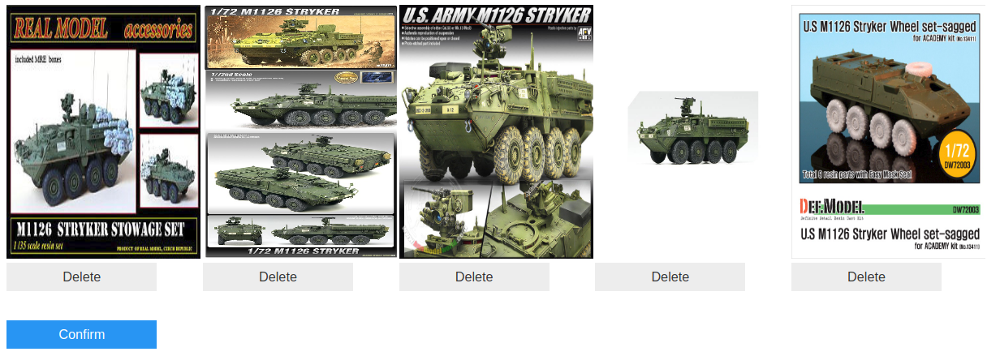


```python
# dup detection
curator.duplicate_detection()
```


 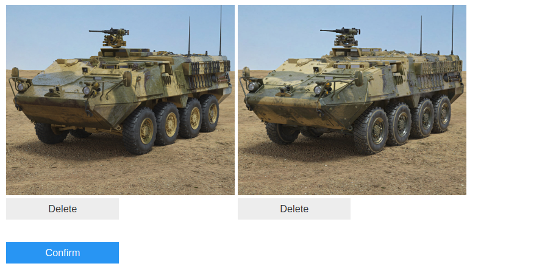


```python
# get images of 2S19
imgs = [os.path.join('2s19', file_name) for file_name in os.listdir('2s19')]

# create curator
curator = Curator(img_paths=imgs)
```


```python
# garbage
curator.garbage_detection()
```


 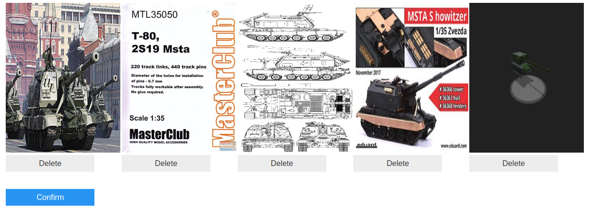


```python
# duplicate
curator.duplicate_detection()
```


 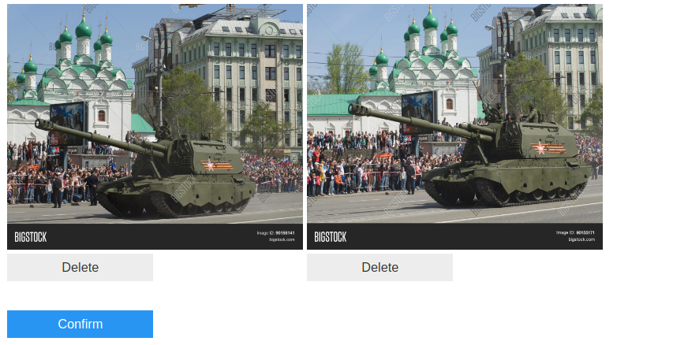


```python
# get images of T-90
imgs = [os.path.join('t90', file_name) for file_name in os.listdir('t90')]

# create curator
curator = Curator(img_paths=imgs)
```


```python
# garbage
curator.garbage_detection()
```


 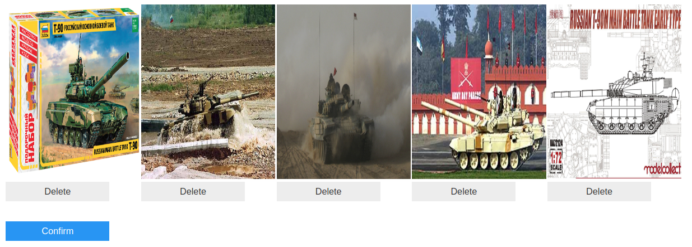


```python
# duplicates
curator.duplicate_detection()
```


 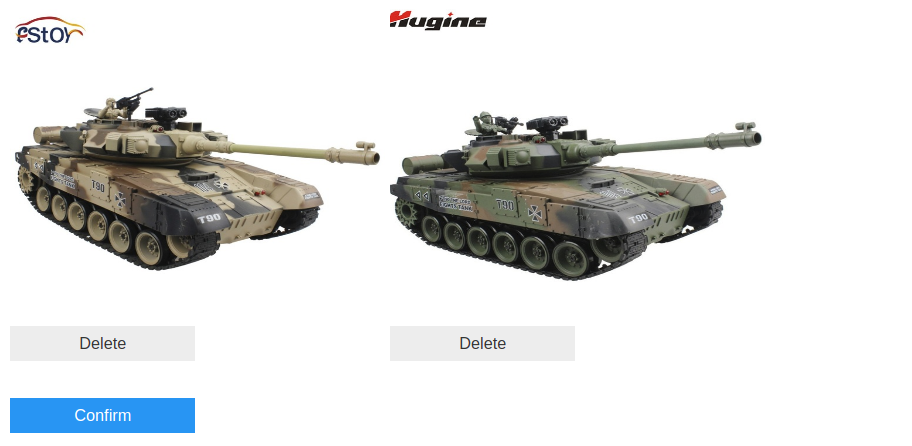


```python
# get images of BMP-3
imgs = [os.path.join('bmp3', file_name) for file_name in os.listdir('bmp3')]

# create curator
curator = Curator(img_paths=imgs)
```


```python
# garbage detection
curator.garbage_detection()
```


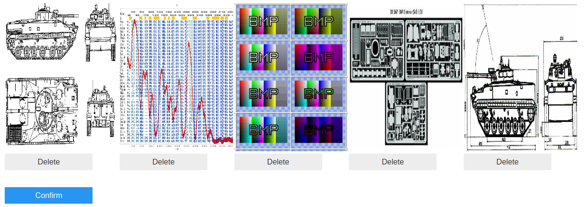


```python
# duplicate detection
curator.duplicate_detection()
```


 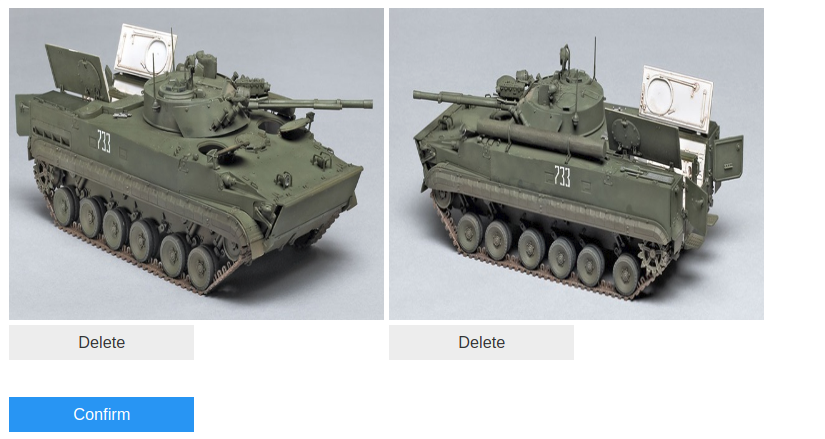


```python
# get images of BTR-80
imgs = [os.path.join('btr80', file_name) for file_name in os.listdir('btr80')]

# create curator
curator = Curator(img_paths=imgs)
```


```python
# garbage
curator.garbage_detection()
```


 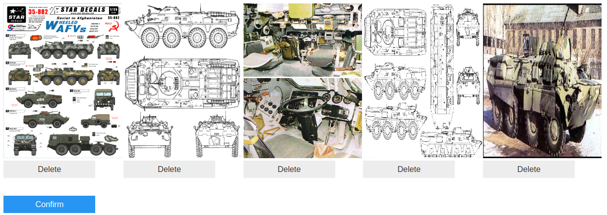


```python
# duplicate detection
curator.duplicate_detection()
```


 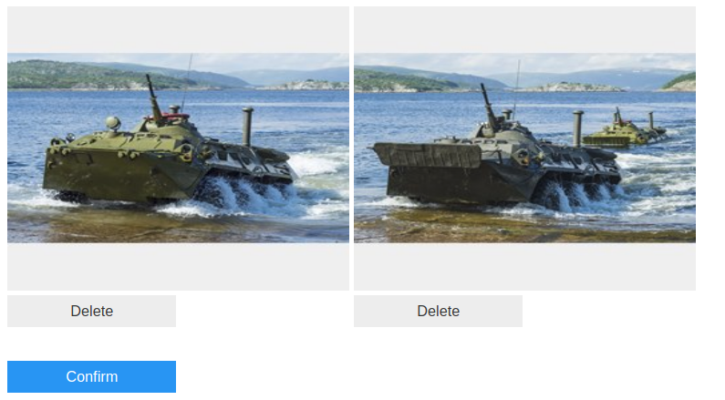


### Step 3. Train/Test a Model
We're going to use fastai to take a network trained on the imagenet dataset and transfer it to this new task by training the final layer.


```python
from fastai import *
from fastai.vision import *
```


```python
# collect the paths to all our image files
files = []
for label in labels:
    files = files + get_image_files(label)
```


```python
# Crate an ImageDataBunch which automatically parses the dataset into a train/val split
# the from_name_re infers the label from the regex
data = ImageDataBunch.from_name_re(path=os.getcwd(), 
                                   fnames=files, 
                                   pat=r'/([^/]+)_',
                                   ds_tfms=get_transforms(), 
                                   size=224, 
                                   bs=32)
```


```python
# display a batch (images will be loaded, resized, and transformed according to ds_tfms)
data.show_batch(3)
```


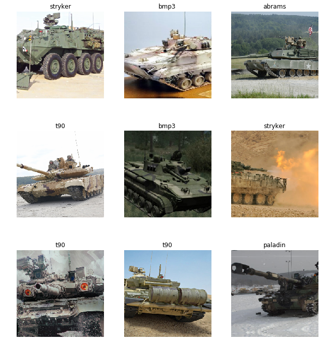


```python
# create a pretrained resnet with new head which we'll train on our data
learner = create_cnn(data, models.resnet50, metrics=error_rate)
```


```python
# find a suitable learning rate range
learner.lr_find()
learner.recorder.plot()
```

    LR Finder complete, type {learner_name}.recorder.plot() to see the graph.


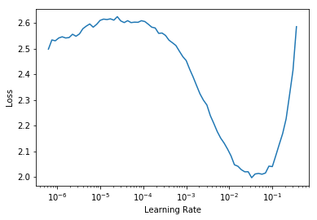


```python
# let's target that obvious down slope
learner.fit_one_cycle(10, 5e-3)
```

    Total time: 05:44
    epoch  train_loss  valid_loss  error_rate
    1      1.520235    0.967611    0.306283    (00:31)
    2      1.041822    0.913308    0.316754    (00:38)
    3      0.762549    0.892272    0.282723    (00:38)
    4      0.688279    0.830369    0.280105    (00:31)
    5      0.630970    0.716486    0.219895    (00:32)
    6      0.519850    0.621779    0.191099    (00:33)
    7      0.382812    0.528556    0.193717    (00:33)
    8      0.271183    0.554528    0.172775    (00:34)
    9      0.213986    0.531421    0.172775    (00:33)
    10     0.179129    0.515581    0.170157    (00:35)
    


```python
# Over 80% accuracy by just training the final layers!
# Let's see what our model is getting wrong
interp = ClassificationInterpretation.from_learner(learner)
```


```python
# first let's look at the confusion matrix
interp.plot_confusion_matrix()
```


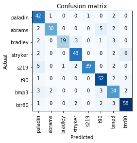


```python
# It looks like most of our losses are being identified as the opposite countries equivalent. 
# let's see the top examples we're getting wrong
interp.plot_top_losses(9)
```


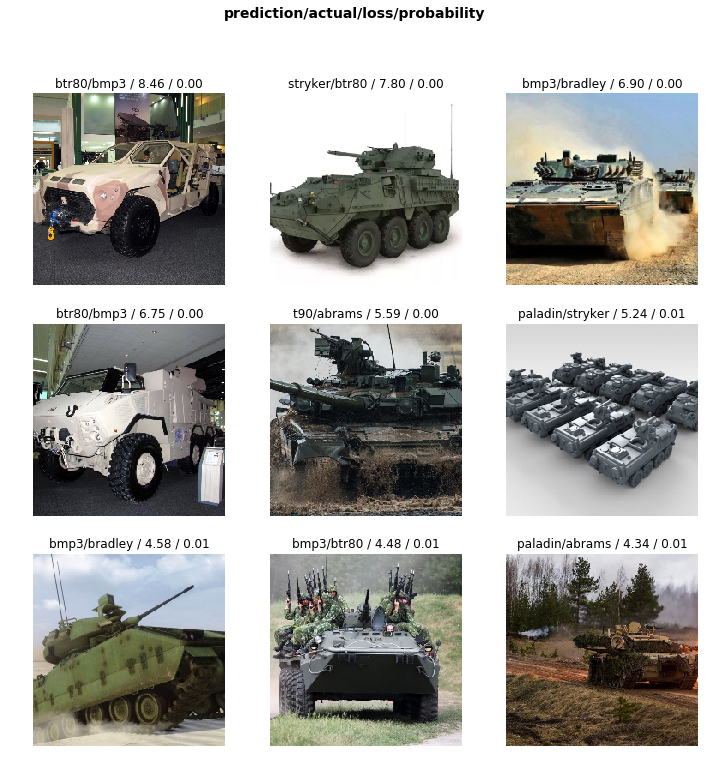


```python
# Some of our top losses are images of other vehicles or mislabels that we didn't catch during curation. 
```


```python

```
